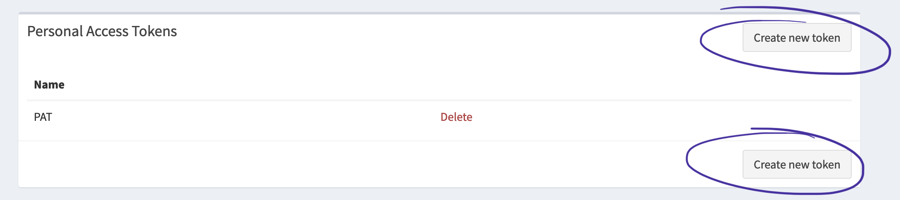
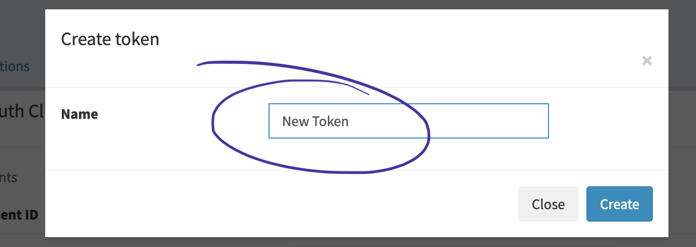
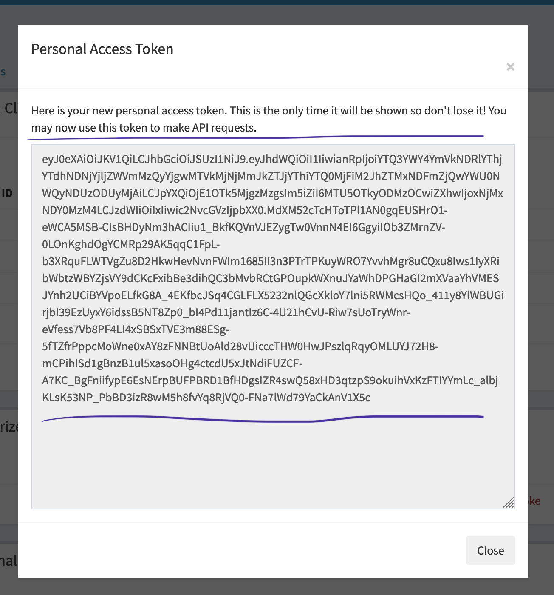
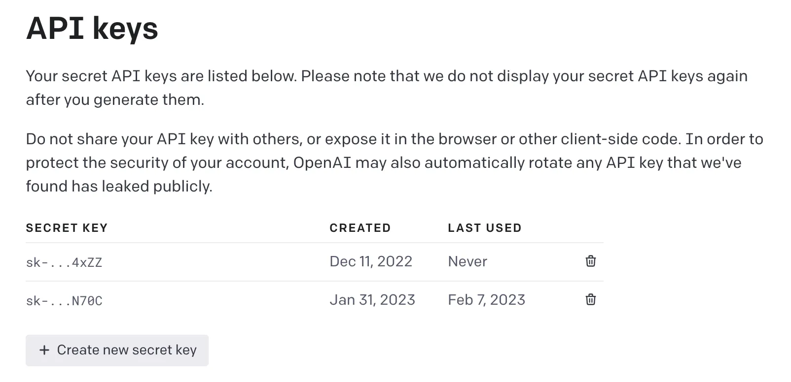
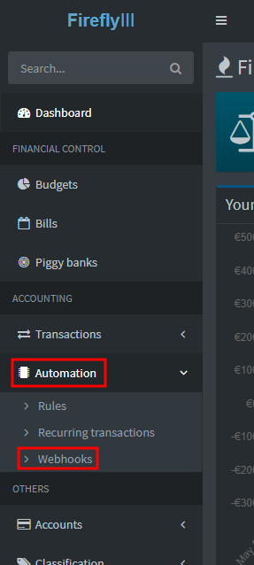
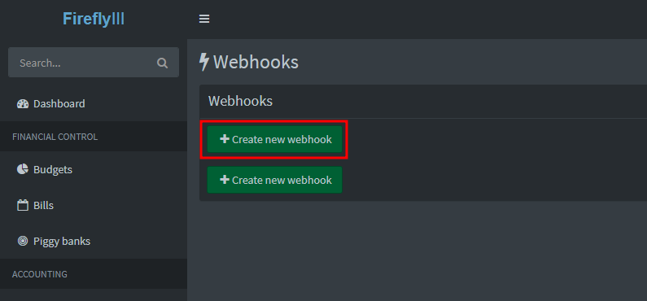

# Firefly III AI categorization

This project allows you to automatically categorize your expenses in [Firefly III](https://www.firefly-iii.org/) by
using OpenAI.

## How it works

It provides a webhook that you can set up to be called every time a new expense is added.

It will then generate a prompt for OpenAI, including your existing categories, the recipient and the description of the
transaction.

OpenAI will, based on that prompt, guess the category for the transaction.

If it is one of your existing categories, the tool will set the category on the transaction and also add a tag to the
transaction.

If it cannot detect the category, it will not update anything.

## Privacy

Please note that some details of the transactions will be sent to OpenAI as information to guess the category.

These are:

- Transaction description
- Name of transaction destination account
- Names of all categories

## Installation

### 1. Get a Firefly Personal Access Token

You can generate your own Personal Access Token on the Profile page. Login to your Firefly III instance, go to
"Options" > "Profile" > "OAuth" and find "Personal Access Tokens". Create a new Personal Access Token by clicking on
"Create New Token". Give it a recognizable name and press "Create". The Personal Access Token is pretty long. Use a tool
like Notepad++ or Visual Studio Code to copy-and-paste it.





### 2. Get an OpenAI API Key

The project needs to be configured with your OpenAI account's secret key.

- Sign up for an account by going to the OpenAI website (https://platform.openai.com)
- Once an account is created, visit the API keys page at https://platform.openai.com/account/api-keys.
- Create a new key by clicking the "Create new secret key" button.

When an API key is created you'll be able to copy the secret key and use it.



Note: OpenAI currently provides 5$ free credits for 3 months which is great since you won’t have to provide your
payment details to begin interacting with the API for the first time.

After that you have to enable billing in your account.

Tip: Make sure to set budget limits to prevent suprises at the end of the month.

### 3. Start the application via Docker

#### 3.1 Docker Compose

Create a new file `docker-compose.yml` with this content (or add to existing docker-compose file):

```yaml
version: '3.3'

services:
  categorizer:
    image: ghcr.io/bahuma20/firefly-iii-ai-categorize:latest
    restart: always
    ports:
      - "3000:3000"
    environment:
      FIREFLY_URL: "https://firefly.example.com"
      FIREFLY_PERSONAL_TOKEN: "eyabc123..."
      OPENAI_API_KEY: "sk-abc123..."
```

Make sure to set the environment variables correctly.

Run `docker-compose up -d`.

Now the application is running and accessible at port 3000.

#### 3.2 Manually via Docker

Run this Docker command to start the application container. Edit the environment variables to match the credentials
created before.

```shell
docker run -d \
-p 3000:3000 \
-e FIREFLY_URL=https://firefly.example.com \
-e FIREFLY_PERSONAL_TOKEN=eyabc123... \
-e OPENAI_API_KEY=sk-abc123... \
ghcr.io/bahuma20/firefly-iii-ai-categorize:latest
```

### 4. Set up the webhook

After starting your container, you have to set up the webhook in Firefly that will automatically trigger the
categorization everytime a new transaction comes in.

- Login to your Firefly instance
- In the sidebar go to "Automation" > "Webhooks"
- Click "Create new webhook"
- Give the webhook a title. For example "AI Categorizer"
- Set "Trigger" to "After transaction creation" (should be the default)
- Set "Response" to "Transaction details" (should be the default)
- Set "Delivery" to "JSON" (should be the default)
- Set "URL" to the URL where the application is reachable + "/webhook". For example if you are using docker-compose your
  URL could look like this: `http://categorizer:3000/webhook`
- Click "Submit"





Now you are ready and every new withdrawal transaction should be automatically categorized by OpenAI.

## User Interface

The application comes with a minimal UI that allows you to monitor the classification queue and see the OpenAI prompts
and responses. This UI is disabled by default.

To enable this UI set the environment variable `ENABLE_UI` to `true`.

After a restart of the application the UI can be accessed at `http://localhost:3000/` (or any other URL that allows you
to reach the container).

## Adjust Tag name

The application automatically sets the tag "AI categorized" on every transaction that was processed and a category could
be guessed.

You can configure the name of this tag by setting the environment variable `FIREFLY_TAG` accordingly.

## Running on a different port

If you have to run the application on a different port than the default port `3000` set the environment variable `PORT`.

## Full list of environment variables

- `FIREFLY_URL`: The URL to your Firefly III instance. Example: `https://firefly.example.com`. (required)
- `FIREFLY_PERSONAL_TOKEN`: A Firefly III Personal Access Token. (required)
- `OPENAI_API_KEY`: The OpenAI API Key to authenticate against OpenAI. (required)
- `ENABLE_UI`: If the user interface should be enabled. (Default: `false`)
- `FIREFLY_TAG`: The tag to assign to the processed transactions. (Default: `AI categorized`)
- `PORT`: The port where the application listens. (Default: `3000`)
